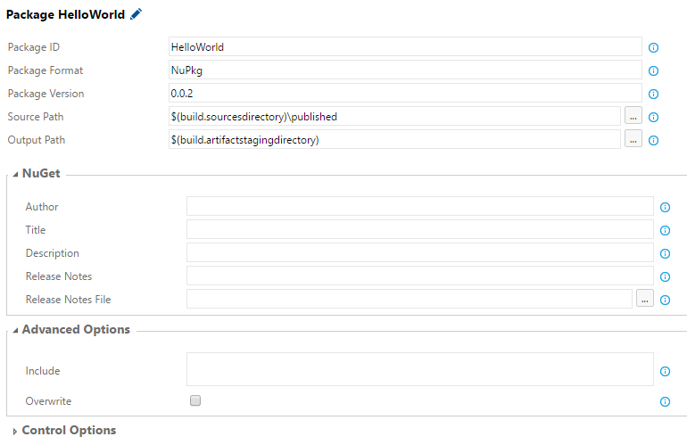
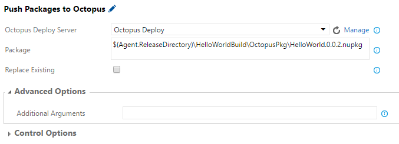
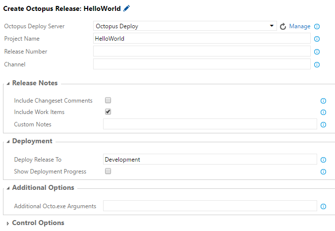
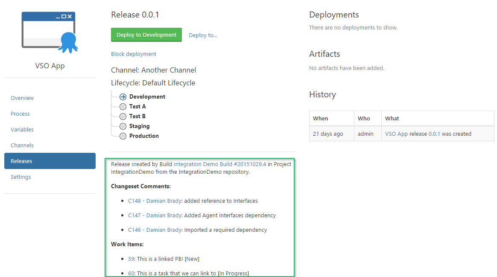
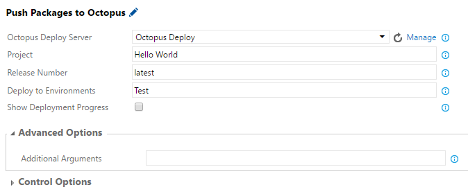

Build and Release tasks to integrate with [Octopus Deploy](http://octopus.com).

## Setup

If you'd like to install from code, detailed installation instructions can be found at [http://docs.octopusdeploy.com/display/OD/Use+the+Team+Foundation+Build+Custom+Task](http://docs.octopusdeploy.com/display/OD/Use+the+Team+Foundation+Build+Custom+Task)

### Create Connected Service
Before starting, configure a "Generic" connected service in the administration section for your project.

Use "octopus" for the User name and your Octopus API Key for the Password/Token Key setting.

## Tasks

This extension adds the following tasks:

- [Package Application](#package-application)
- [Push Packages to Octopus](#push-packages-to-octopus)
- [Create Octopus Release](#create-octopus-release)
- [Deploy Octopus Release](#deploy-octopus-release)

### Package Application

*Note: You can still use [OctoPack](http://docs.octopusdeploy.com/display/OD/Using+OctoPack) as part of your MSBuild task to package and push Nuget packages.*

 
 Options include:
 * **Package ID**: The ID of the package. e.g. MyCompany.App
 * **Package ID**: NuPkg or Zip
 * **Package Version**: The version of the package; must be a valid [SemVer](http://semver.org/) version; defaults to a timestamp-based version.
 * **Source Path**: The folder containing the files and folders to package. Defaults to working directory.
 * **Output Path**: The directory into which the generated package will be written. Defaults to working directory.
 * **Additional Octo.exe Arguments**:  Any additional [Octo.exe arguments](http://docs.octopusdeploy.com/display/OD/Using+Octo.exe) to include

### Push Packages to Octopus

 
 Options include:
 * **Octopus Deploy Server**:  Dropdown for selecting your Octopus Server (should already have been [created](#create-connected-service))
 * **Package**: Package file to push. To push multiple packages, enter on multiple lines.
 * **Replace Existing**: If the package already exists in the repository, the default behavior is to reject the new package being pushed. Set this flag to 'True' to overwrite the existing package.
 * **Additional Octo.exe Arguments**:  Any additional [Octo.exe arguments](http://docs.octopusdeploy.com/display/OD/Pushing+packages) to include

### Create Octopus Release

 

 Options include:
 * **Octopus Deploy Server**:  Dropdown for selecting your Octopus Server (should already have been [created](#create-connected-service))
 * **Project Name**: The name of the project to create a release for
 * **Release Number**: [Optional] Release number for the new release
 * **Channel**: [Optional] Channel to use for the new release
 * **Include Changeset comments**:  Whether to include changeset comments in the release notes
 * **Include Work Items**:  Whether to include work item titles in the release notes
 * **Deploy Release To**:  Optional environment to automatically deploy to (uses the [`--deployTo` argument in octo.exe](http://docs.octopusdeploy.com/display/OD/Creating+releases))
 * **Show Deployment Progress**: Output from the deployment will appear in the log. If checked, the task will only succeed if the deployment is successful.
 * **Additional Octo.exe Arguments**:  Any additional [Octo.exe arguments](http://docs.octopusdeploy.com/display/OD/Creating+releases) to include

#### Release Notes:

The *Release Notes* options, if selected, will result in nicely formatted release notes with deep links to Team Foundation Server or Visual Studio Online.

###  Deploy Octopus Release

 

 Options include:
 * **Octopus Deploy Server**:  Dropdown for selecting your Octopus Server (should already have been [created](#create-connected-service))
